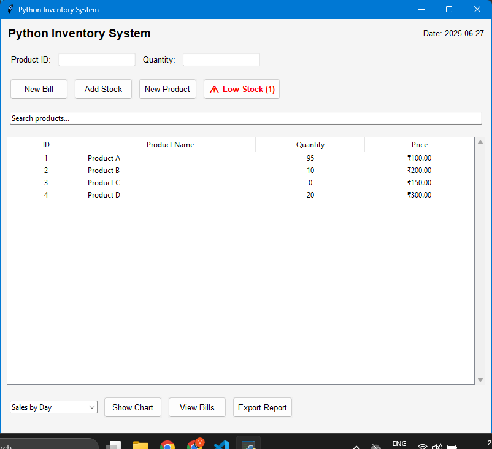
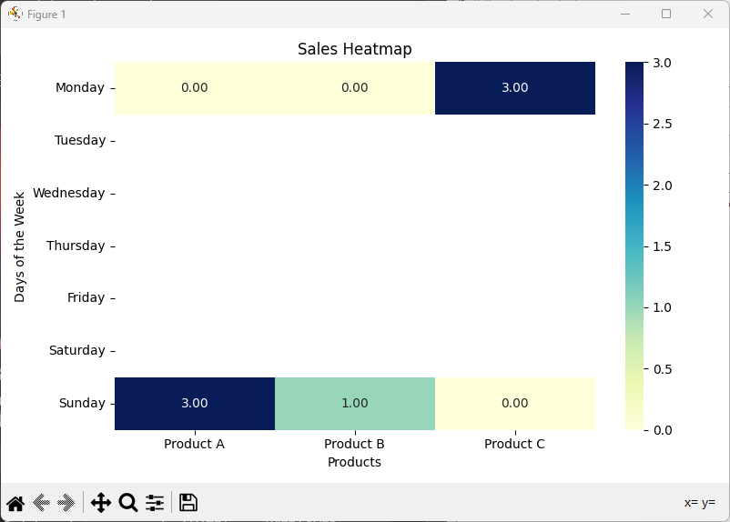
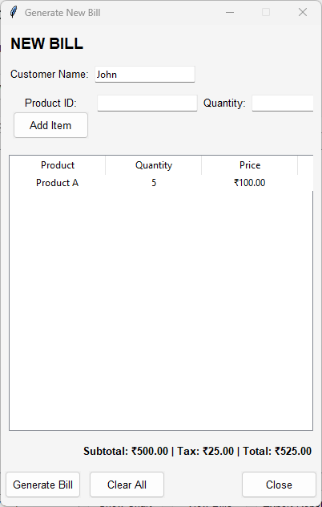
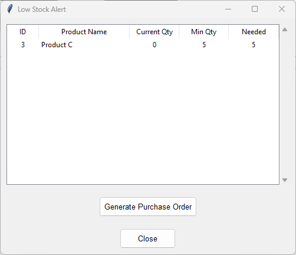

# 📦 Python Inventory System

**Python Inventory System** is an open-source, feature-rich **Inventory & Billing Management System** built with **Python Tkinter**, **Pandas**, and **Matplotlib**. Designed for retail shops and small businesses, it offers complete control over stock, billing, and reporting in one lightweight desktop app.

---

## 🧾 One-liner Description

> A modern Python desktop app to manage inventory, generate bills, track sales, and visualize performance—beautifully crafted for retail and SME use.

---

## 📋 Features

| Category             | Features                                                                 |
|----------------------|--------------------------------------------------------------------------|
| 🔄 Inventory Control  | Add products, update stock, set min stock threshold, search/filter      |
| 🧾 Billing System     | Multi-product billing with live totals, customer info, PDF-style receipt|
| ⚠️ Low Stock Alerts   | Automated alerts + purchase order generation for low-stock items        |
| 📊 Charts & Reports   | View sales by day, top products, and heatmaps using Matplotlib & Seaborn|
| 📂 Data Export        | Export sales or inventory reports to CSV instantly                      |
| 🧾 Bill History       | View & search past bills with filters                                    |
| 🔍 Search System      | Live search for both inventory and bills                                |
| 🕒 Live Clock         | Real-time time display on the dashboard                                 |
| 📁 Offline Database   | Uses local CSV-based structured storage (data/ directory)               |

---

## 🗂️ Project Structure

```
SmartInventoryPro/
├── main.py                 # Main GUI application
├── data/
│   ├── inventory.csv       # Product inventory
│   ├── transactions.csv    # Sales transactions log
│   ├── bills.csv           # Bill data
├── README.md               # This file
├── assets/                 # This contains screenhots of the software
```

---

## 🧰 Tech Stack

- **Frontend:** Tkinter (Python GUI)
- **Backend/Data:** Pandas, datetime, UUID
- **Visualization:** Matplotlib, Seaborn
- **Data Storage:** CSV (offline files in `data/` folder)

---

## 🚀 Getting Started

### 1. Clone the Repo
```bash
git clone https://github.com/vaibhavrawat27/python-inventory-system.git
cd python-inventory-system
```

### 2. Install Required Libraries
```bash
pip install pandas matplotlib seaborn
```

### 3. Prepare the Data Folder
```bash
mkdir data
echo "product_id,name,quantity,price,min_stock" > data/inventory.csv
echo "date,time,product_id,quantity_sold" > data/transactions.csv
echo "bill_id,date,product,quantity,price,subtotal,tax,total,customer" > data/bills.csv
```

### 4. Run the App
```bash
python main.py
```

---

## 🧪 Screenshots

### 📊 Dashboard


---

### 📈 Charts & Insights


---

### 🧾 Billing Interface


---

### 📦 Stock & Low Inventory Alerts


---

## 🔐 Roadmap (Future Features)

- Admin login & user roles  
- Print-ready receipts (PDF export)  
- Email alerts for low stock  
- Supplier/vendor management  
- SQLite or Cloud DB backend  

---

## 📄 License

Licensed under the **MIT License** — use it freely for personal or commercial projects.

---

## 🤝 Contributing

We welcome contributions and suggestions!  
To contribute:

1. Fork this repo
2. Create a feature branch (`git checkout -b feature-name`)
3. Commit your changes (`git commit -m 'Add new feature'`)
4. Push to the branch (`git push origin feature-name`)
5. Open a Pull Request

---

## 💡 Acknowledgements

- Python Software Foundation  
- Matplotlib & Seaborn for charting  
- Community contributors and testers  

---

## 👤 Author

**Vaibhav Rawat**  
📧 *rawatvaibhav27@gmail.com*  
🌐 [GitHub](https://github.com/vaibhavrawat27)
